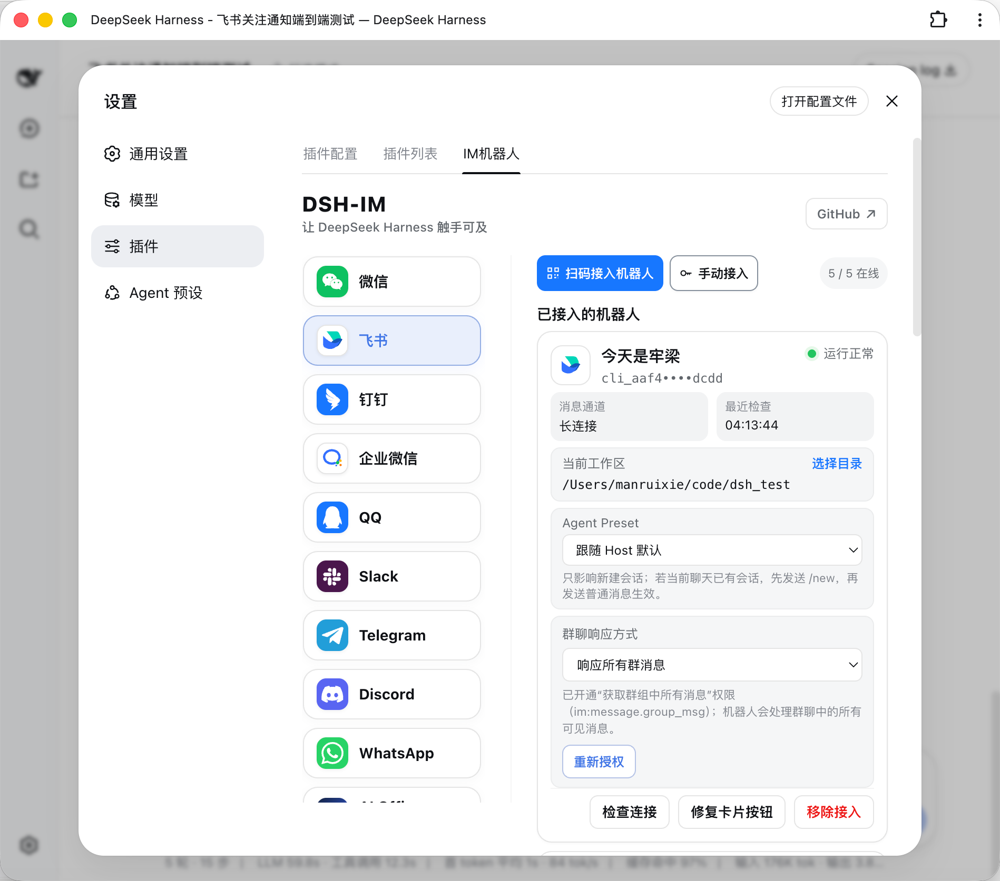

# dsh-im

## 中文

通过扫码把 IM 机器人接入 DeepSeek Harness。一个插件、一个设置入口，统一管理飞书、微信和钉钉机器人。

> GitHub 简介：通过扫码把IM机器人接入DeepSeek Harness（支持飞书、微信、钉钉等）。

## 界面



## 当前内置渠道

- 飞书：扫码创建并绑定机器人，使用长连接收发消息；
- 微信：扫码绑定微信机器人，使用腾讯 iLink 长轮询收发消息；
- 钉钉：扫码创建并授权机器人，使用钉钉 Stream 长连接收发消息。

其他 IM 平台可继续按同一渠道适配器结构接入。

## 安装

```sh
npx -y github:xmanrui/dsh-im install
```

重启 `dsh web`，然后打开「设置 → 插件 → IM机器人」。安装器会用 `dsh-im` 替换 profile 中直接安装的 `dsh-feishu`、`dsh-weixin` 和 `dsh-dingtalk`，但不删除任何渠道数据；原有渠道凭据和扫码绑定会继续使用。

钉钉接入时，请使用已加入企业/组织且有权创建机器人的钉钉账号扫描页面二维码，再在钉钉授权页点击「一键创建新机器人」。若提示“该账号还未加入组织”，请先创建组织或换用已加入组织的账号后重新扫码。钉钉当前可能在该官方授权页显示 OpenClaw 品牌；扫码后的机器人连接、凭据和消息均由 DeepSeek Harness 管理。由于扫码结果不包含扫码人的 staff ID，首次私聊后还需要在本机页面批准该使用者，未批准消息不会进入 Harness。

## 设计

- Harness 中只注册一个「IM机器人」设置页；
- 左侧使用渠道 Logo 切换微信、飞书和钉钉，不使用启用/停用开关；
- 三个渠道保持独立的 RPC、凭据、连接监督和会话映射；
- 浏览器只获得二维码和脱敏状态，不获得 App Secret、`bot_token`、钉钉 `client_secret` 或原始 staff ID。

## 本地开发

```sh
npm install
npm run check
node bin/dsh-im.mjs install --source .
```

`npm run check` 运行单元测试、构建 Host/Client 产物，并验证发布包不包含凭据或独立渠道设置页注册。

---

## English

Connect IM bots to DeepSeek Harness by scanning a QR code. One plugin and one settings entry provide unified management for Feishu, WeChat, and DingTalk bots.

> GitHub description: Connect IM bots to DeepSeek Harness by scanning a QR code (supports Feishu, WeChat, DingTalk, and more).

## Interface


## Built-in channels

- Feishu: create and bind a bot by scanning a QR code, then send and receive messages over a persistent connection.
- WeChat: bind a WeChat bot by scanning a QR code, then send and receive messages through Tencent iLink long polling.
- DingTalk: create and authorize a bot by scanning a QR code, then send and receive messages through DingTalk Stream.

Other IM platforms can be added through the same channel-adapter structure.

## Installation

```sh
npx -y github:xmanrui/dsh-im install
```

Restart `dsh web`, then open **Settings → Plugins → IM Bot**. The installer replaces directly installed `dsh-feishu`, `dsh-weixin`, and `dsh-dingtalk` entries in the profile with `dsh-im` without deleting channel data.

For DingTalk, scan with an account that belongs to an enterprise or organization and can create bots, then choose **Create a new bot** on the authorization page. If DingTalk reports that the account has not joined an organization, create one or switch to an account that has, then scan again. That DingTalk-hosted page may currently display OpenClaw branding; the resulting connection, credentials, and messages are managed by DeepSeek Harness. Because the scan result does not identify the scanning user, send the bot a direct message and approve that sender locally before the message can enter Harness.

## Design

- Registers a single **IM Bot** settings page in Harness.
- Uses channel logos for WeChat, Feishu, and DingTalk navigation without enable/disable switches.
- Keeps RPC endpoints, credentials, connection supervision, and session mappings isolated by channel.
- Sends only QR codes and redacted status data to the browser, never App Secrets, `bot_token`, DingTalk `client_secret`, or raw staff IDs.

## Local development

```sh
npm install
npm run check
node bin/dsh-im.mjs install --source .
```

`npm run check` runs unit tests, builds the Host and Client artifacts, and verifies that the published package contains neither credentials nor standalone channel settings-page registrations.
